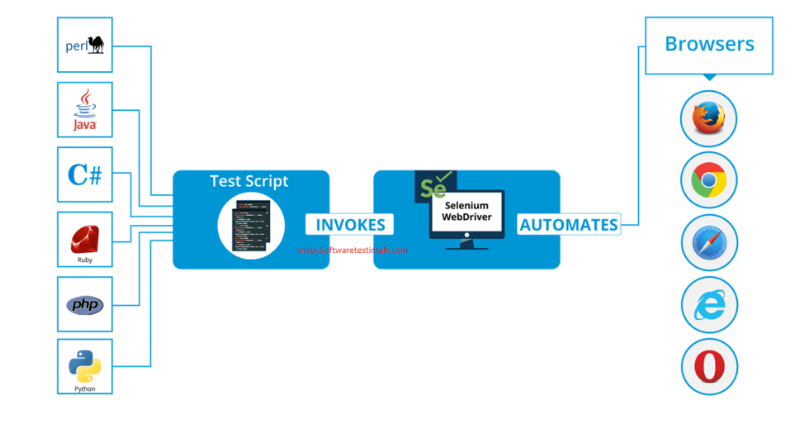

# Poem Generation Solution

## Overview
This project develops an end-to-end Vietnamese poem generation system using multiple deep learning approaches. The system automatically creates Vietnamese poetry with artistic coherence and semantic meaning through advanced natural language processing techniques.

## Project Description

## Pipeline Architecture

## Implementation Approaches

### 1. Data Collection with Selenium

This project implements automated web crawling using Selenium to gather Vietnamese poem datasets from various online sources, creating a comprehensive training corpus.

### 2. Transformer Model from Scratch

This project builds a custom Transformer architecture with attention mechanisms, training from scratch on collected Vietnamese poetry data to understand poetic patterns and structures.

### 3. GPT-2 Fine-tuning

This project leverages transfer learning by fine-tuning pre-trained GPT-2 models on Vietnamese poetry, utilizing the HuggingFace Transformers library for optimal performance and generation quality.

## Key Features
- Automated Vietnamese poem data collection
- Custom Transformer implementation with attention mechanisms
- Pre-trained model fine-tuning for Vietnamese poetry
- End-to-end pipeline for poem generation
- Multiple generation approaches for comparison and optimization

